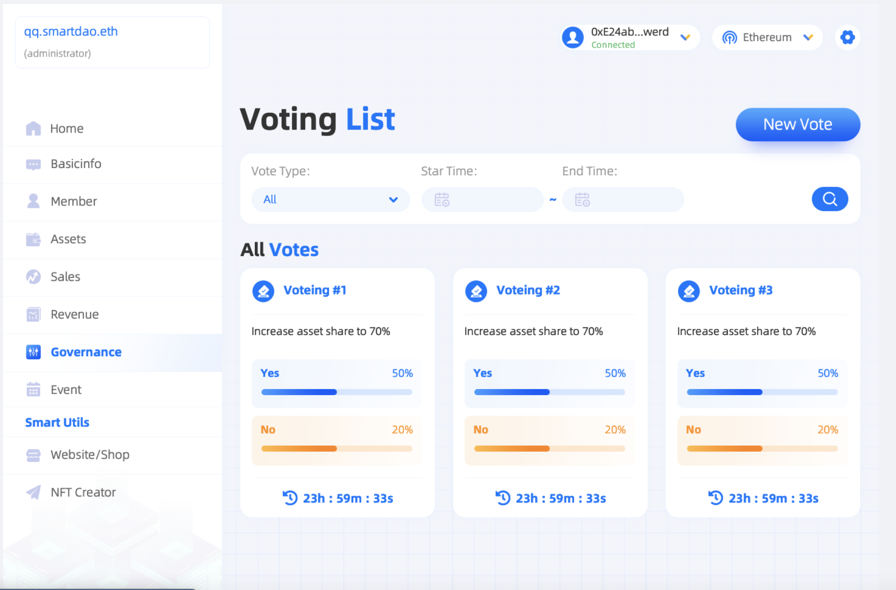

# 治理管理及投票

**Governance模块用于DAO治理，持有NFTP资产的DAO成员可以发起提案并进行投票，投票是否能通过遵循** [**DAO投票模型**](../shi-yong-launch-qi-dong-dao/she-zhi-dao-tou-piao-mo-xing.md) **规则，投票通过后，智能合约将会根据提案执行具体内容。**

****

投票列表页：

<figure><figcaption></figcaption></figure>

投票详情页：

<figure><figcaption></figcaption></figure>

DA成员发起投票：

<figure><figcaption></figcaption></figure>
