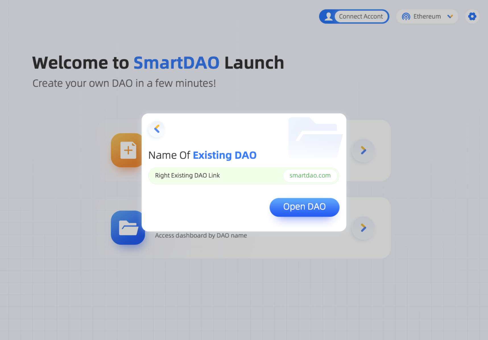

# 数字钱包插件准备


**Good to know:** You can use the mobile digital wallet app or metamask (chrome browser plugin) The metamask plugin is recommended.


## metamask钱包插件安装

#### :tada:[下载安装metamask插件](https://chrome.google.com/webstore/detail/metamask/nkbihfbeogaeaoehlefnkodbefgpgknn?hl=zh-CN\&utm\_source=chrome-ntp-launcher)

#### :tada:[在Ethereum主网络中创建钱包：](https://chrome-extension/nkbihfbeogaeaoehlefnkodbefgpgknn/home.html#new-account)

.png>)

.png>)

#### 备份私钥或者助记词：

.png>)

.png>)

.png>)

## Creating a project

Hit the big '+' button in your sidebar and select 'New Project' from the menu that pops up. Give your project a name, and you're good to go!
